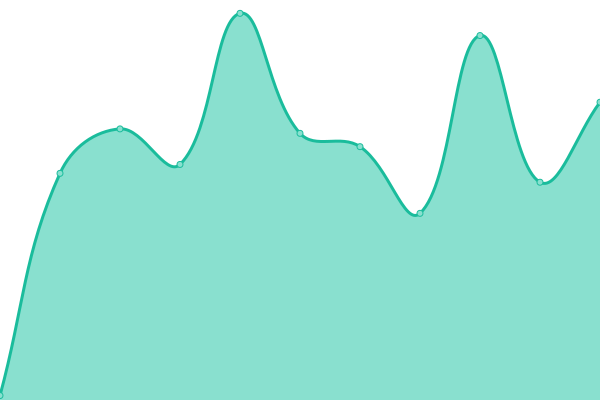
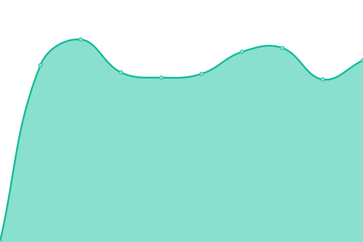
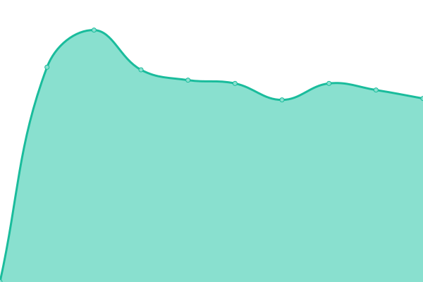
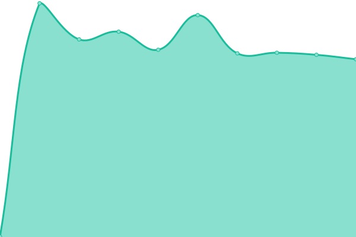
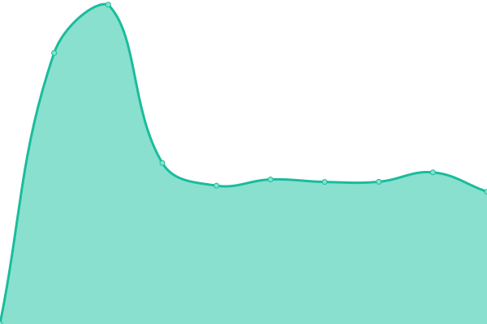

# [📈 Live Status](https://demo.upptime.js.org): <!--live status--> **🟩 All systems operational**

## [up](https://j0hannr.github.io/upptime/)

This repository contains the open-source uptime monitor and status page for [Upptime](https://upptime.js.org), powered by [Upptime](https://github.com/upptime/upptime).

With [Upptime](https://upptime.js.org), you can get your own unlimited and free uptime monitor and status page, powered entirely by a GitHub repository. We use [Issues](https://github.com/upptime/upptime/issues) as incident reports, [Actions](https://github.com/upptime/upptime/actions) as uptime monitors, and [Pages](https://demo.upptime.js.org) for the status page.

<!--start: status pages-->
<!-- This summary is generated by Upptime (https://github.com/upptime/upptime) -->
<!-- Do not edit this manually, your changes will be overwritten -->

| URL                                          | Status | History                                                                                                | Response Time                                                                         | Uptime                                                                                                                                                                                                                          |
| -------------------------------------------- | ------ | ------------------------------------------------------------------------------------------------------ | ------------------------------------------------------------------------------------- | ------------------------------------------------------------------------------------------------------------------------------------------------------------------------------------------------------------------------------- |
| [Google](https://www.google.com)             | 🟩 Up  | [google.yml](https://github.com/j0hannr/upptime/commits/master/history/google.yml)                     |  84ms            |                     |
| [Arrenberg App](https://arrenberg.app)       | 🟩 Up  | [arrenberg-app.yml](https://github.com/j0hannr/upptime/commits/master/history/arrenberg-app.yml)       |  747ms    |        |
| [Studio Arrenberg](https://arrenberg.studio) | 🟩 Up  | [studio-arrenberg.yml](https://github.com/j0hannr/upptime/commits/master/history/studio-arrenberg.yml) |  414ms |  |
| [Johann Rohn](https://johannrohn.de)         | 🟩 Up  | [johann-rohn.yml](https://github.com/j0hannr/upptime/commits/master/history/johann-rohn.yml)           |  765ms      |            |
| [Frauenweihe](https://frauenweihe-jetzt.de)  | 🟩 Up  | [frauenweihe.yml](https://github.com/j0hannr/upptime/commits/master/history/frauenweihe.yml)           |  625ms      |            |
| [NaSchBeLa](https://naschbela.de)            | 🟩 Up  | [na-sch-be-la.yml](https://github.com/j0hannr/upptime/commits/master/history/na-sch-be-la.yml)         |  1088ms    |         |

<!--end: status pages-->

[**Visit our status website →**](https://demo.upptime.js.org)

## 📄 License

- Code: [MIT](./LICENSE) © [Upptime](https://upptime.js.org)
- Data in the `./history` directory: [Open Database License](https://opendatacommons.org/licenses/odbl/1-0/)
